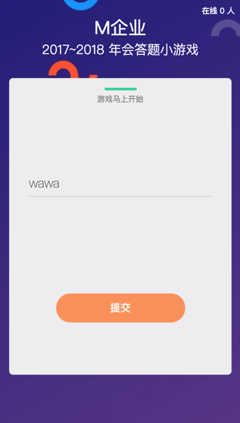
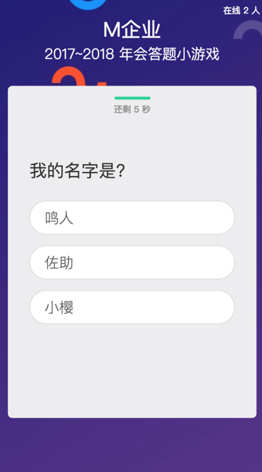

# 应用截图




# 整体架构
整体架构采用前后端分离架构，前端为 front-server 文件夹，服务端为 backend-server 文件夹.
前端与服务端分别采用不同的域名，并进行了跨域配置

# front-server 使用说明

## 文件架构介绍
* `index.html` - 主前端文件
* `client` - 客户端相关代码
* `server.js` - 简易的前端服务器

## 如何启动
* 配置本地机器 `hosts` 文件 `前端服务器域名`，`后端服务器域名` 到正确的，项目中默认的配置应该为：
```
    127.0.0.1 api.inter-quiz.top
    127.0.0.1 www.inter-quiz.top
```
* 配置 `server.js` 中的启动端口 `port`
* 配置 `client/main.js` 中配置 `后端服务器域名`，`管理员帐号`
* `npm start`
* 访问 `前端服务器域名`

# backend-server 使用说明

## 简介

1. 后端基于 `Scala`, `Play`, `Akka` 开发
2. 用户与服务器建立 `WebSocket` 通信，所有管理员发布的命令通过 `WebSocket` 推送给答题者

## 使用指南

1. 请修改 `application.conf` 文件中的 `admin.name`，当在界面上输入该名字时，该人就作为管理员，建议一些奇怪组合
2. 由于前后端分开开发，需要跨域访问，请更改 `application.conf` 中的 `play.filters.hosts.allowed` 改为正确的域名。
3. 请将题目拷贝至 `conf/questions.json` 中，所有的题库组成一个大 `Json`
4. `sbt "~run 8080"`

## 部署指南
1. 为了快速部署，直接使用 `sbt assembly` 将所有配置文件与 `Jar` 包打成一个大 `Jar` 包，拷贝到服务器上
2. 运行 `nohup java -Xms2048m -Xmx2048m -Dplay.http.secret.key=quiz -jar -Dhttp.port=8080 interact_quiz-assembly-1.0.jar 2>&1 > start.log &`

# Tips: sbt 仓库配置
```
[repositories]
  local
  maven-local
  ali-maven: http://maven.aliyun.com/nexus/content/groups/public/
  ivy-proxy-releases: http://54.223.132.19:9527/artifactory/scala-repos/, [organization]/[module]/(scala_[scalaVersion]/)(sbt_[sbtVersion]/)[revision]/[type]s/[artifact](-[classifier]).[ext]
  maven-proxy-releases-jfrog: http://54.223.132.19:9527/artifactory/scala-repos/
  maven-proxy-releases: http://54.223.132.19:8081/nexus/content/groups/public/
  maven-central: https://repo1.maven.org/maven2/
  oss-central: https://oss.sonatype.org/content/groups/public/
  typesafe-ivy: https://repo.typesafe.com/typesafe/ivy-releases/, [organization]/[module]/(scala_[scalaVersion]/)(sbt_[sbtVersion]/)[revision]/[type]s/[artifact](-[classifier]).[ext]
  sbt-plugin-release: https://repo.scala-sbt.org/scalasbt/sbt-plugin-releases/, [organization]/[module]/(scala_[scalaVersion]/)(sbt_[sbtVersion]/)[revision]/[type]s/[artifact](-[classifier]).[ext]
  oss-snapshot: https://oss.sonatype.org/content/repositories/snapshots/
```
# Contributors
以下是给我们项目做贡献的兄弟
* [@Liu-Huaqing](https://github.com/Liu-Huaqing)
* [@echobfy](https://github.com/echobfy)